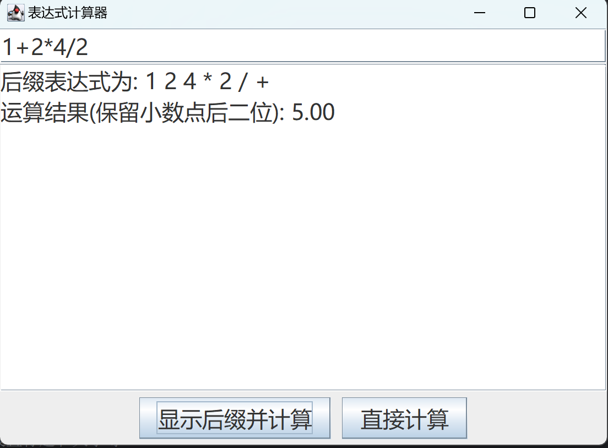

# 简单的中缀转后缀计算器

操作系统小作业，利用栈实现中缀转后缀，java编写简单GUI实现

## 功能：

1. 转换为后缀表达式并输出，然后对后缀表达式求值并输出
2. 不需要显式转换为后缀表达式，直接输出求值结果。

## 界面

## 思路

#### 1. 中缀转后缀

- 创建一个栈存放元素
- 若是数字, 直接弹出
- 若是左括号, 直接入栈
- 若是右括号, 则栈中出栈直到第一个左括号出现
- 若是符号, 栈顶空入栈, 比栈顶符号优先级高入栈
- 注意, 括号只弹出不输出

#### 2. 计算后缀表达式

- 创建一个空栈存放操作数
- 若遇到操作数, 直接进栈, 设栈顶为y, 栈顶下面的为x
- 若遇到操作符, 弹出y和x, 进行运算:y (operator) x, 将结果压入栈
- 一直重复直到栈中只剩最后一个元素, 就是结果

尝试: 9 3 1 - 3 * + 10 2 / + , 结果:20 

#### 3. 直接对中缀表达式求值

- 设置两个栈, 一个存放运算符, 一个存操作数
- 遇到操作数入栈
- 遇到运算符, 比较该运算符和栈顶的优先级, 若**当前优先级高于栈顶**, 则进栈, 否则弹出栈顶元素, 括号同中缀转后缀的规则
- 若弹出了操作符, 从栈顶取出两个元素x, y, 进行运算y operator x , 运算结果存入操作数栈, 以此往复
- 直到操作数只有一个元素, 那就是结果

尝试: (1+9)/(8-2*3+3) = 2

